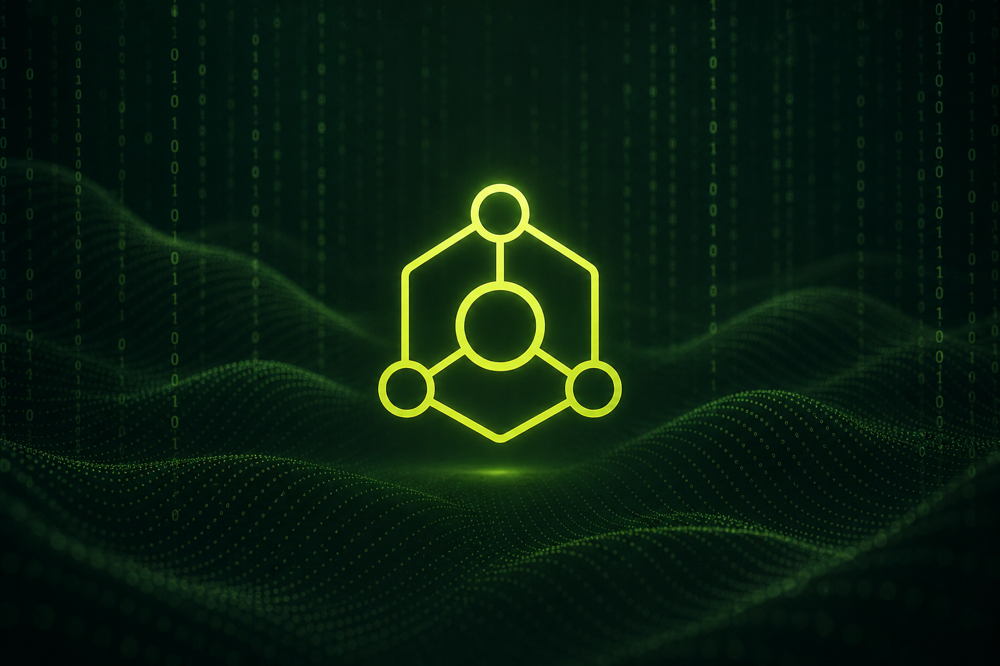

<p align="center">
  
</p>

<h1 align="center">PageAgent Connect</h1>

<p align="center">
  <strong>Ship an in-page AI agent. Connect models in one command.</strong><br />
  Natural-language control for any web UI — no extension required to get started.
</p>

<p align="center">
  <a href="#quick-start"></a>
  <a href="https://github.com/alibaba/page-agent"></a>
  <a href="./LICENSE"></a>
  <a href="https://www.npmjs.com/package/page-agent"></a>
</p>

---

## Why PageAgent Connect

PageAgent puts a GUI agent **inside the page** — text-based DOM control, bring-your-own models, and a path from demo to production.

**Connect** is the commercial on-ramp: a focused console to authenticate providers, select models, and export a one-line integration for any site.

| Capability             | What you get                                                                 |
| ---------------------- | ---------------------------------------------------------------------------- |
| One-command launch     | `npm start` opens the Connect console                                        |
| Model login            | DashScope, OpenAI, OpenRouter, DeepSeek, Ollama, LM Studio, custom endpoints |
| Secure-by-default keys | API keys stay in browser `localStorage` — never committed                    |
| Instant integration    | Script tag, NPM snippet, or bookmarklet for the active model                 |
| Live playground        | Run a natural-language task on a sample page before you ship                 |

Built on [alibaba/page-agent](https://github.com/alibaba/page-agent) `v1.12.1`.

---

## Quick start

```bash
npm install
npm start
```

Open **http://localhost:5173**

1. Choose a provider (or use **Free Demo** for evaluation)
2. Save a model login
3. Copy a connect snippet — or click **Launch on this page**

---

## Integration patterns

### Script tag (fastest)

Paste into any HTML page after selecting a model in Connect:

```html
<script
    src="https://cdn.jsdelivr.net/npm/page-agent@1.12.1/dist/iife/page-agent.demo.js?model=YOUR_MODEL&baseURL=YOUR_BASE_URL&apiKey=YOUR_KEY&lang=en-US"
    crossorigin="anonymous"
></script>
```

### NPM

```bash
npm install page-agent
```

```js
import { PageAgent } from 'page-agent'

const agent = new PageAgent({
    model: 'qwen3.5-plus',
    baseURL: 'https://dashscope.aliyuncs.com/compatible-mode/v1',
    apiKey: process.env.LLM_API_KEY,
    language: 'en-US',
})

await agent.execute('Complete the checkout form')
```

### Production auth (no API key in the browser)

For commercial deployments, keep provider credentials on your server. Users sign into your app; PageAgent calls a same-origin proxy with session cookies:

```js
const agent = new PageAgent({
    baseURL: '/api/llm-proxy',
    model: 'gpt-5.1',
    customFetch: (url, init) => fetch(url, { ...init, credentials: 'include' }),
})
```

> Never commit production LLM API keys to frontend source.

---

## Product surface

```
packages/
  connect/          ← Connect console (npm start)
  page-agent/       ← Core library
  llms/             ← OpenAI-compatible client
  page-controller/  ← DOM interaction layer
  extension/        ← Optional Chrome multi-page agent
  website/          ← Full upstream documentation site
```

| Command                 | Purpose            |
| ----------------------- | ------------------ |
| `npm start`             | Connect console    |
| `npm run start:website` | Upstream docs site |
| `npm run build`         | Build packages     |
| `npm run dev:demo`      | Library demo       |

---

## Security & compliance notes

- **BYOK architecture** — the client does not host model inference
- **Local key storage** in Connect — keys remain on the operator’s machine
- **Free Demo endpoint** — evaluation only; see [terms & privacy](./docs/terms-and-privacy.md)
- **Recommended production path** — authenticated backend proxy + `customFetch`

---

## License & attribution

MIT License — see [LICENSE](./LICENSE).

PageAgent is upstream open source from [Alibaba page-agent](https://github.com/alibaba/page-agent). This repository packages that codebase with the Connect console for streamlined commercial evaluation and integration.

DOM processing and prompt patterns acknowledge [browser-use](https://github.com/browser-use/browser-use).

---

<p align="center">
  <sub>PageAgent Connect · One command. Your models. Any page.</sub>
</p>
